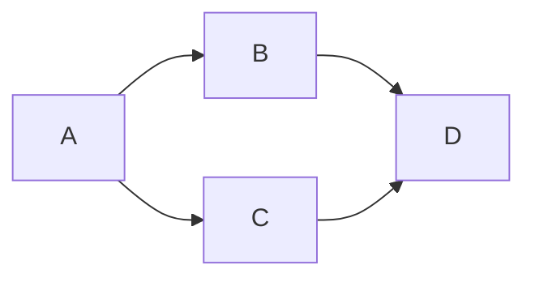
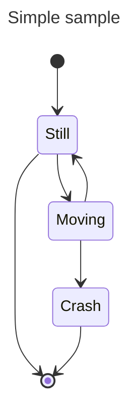
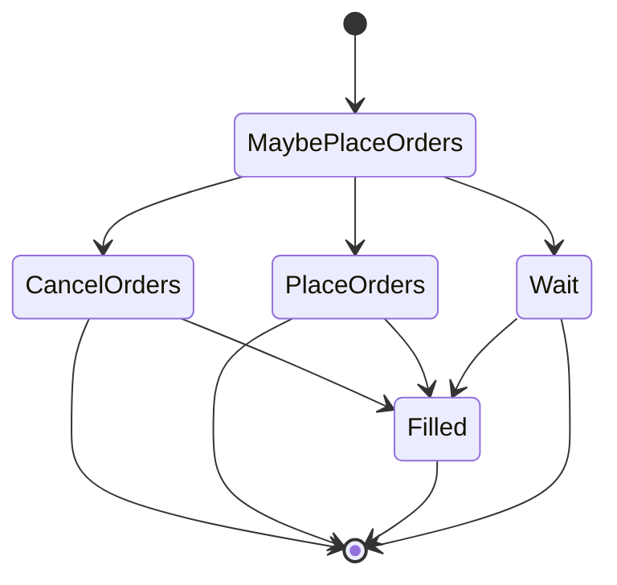
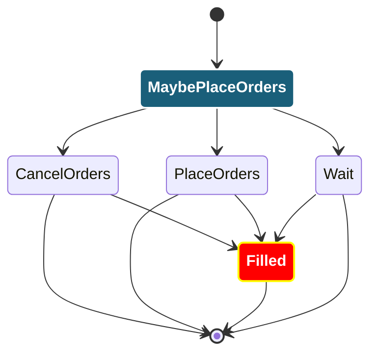
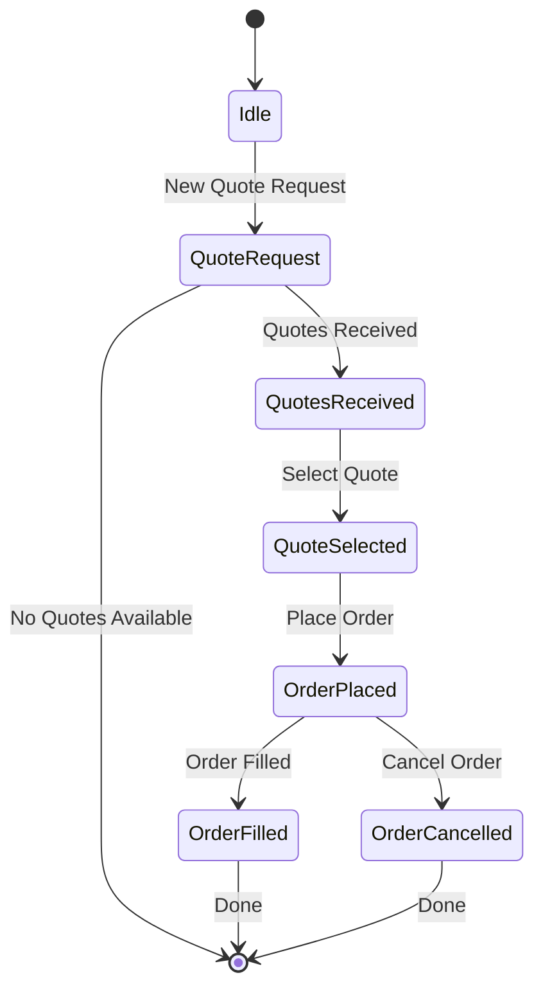

[Mermaid](https://mermaid.js.org/) is a JavaScript library that allows you to create diagrams and charts using simple text syntax. With Mermaid, you can easily create professional-looking diagrams without using a graphical interface or specialized software. In this post, we'll concentrate on state diagrams, but Mermaid also supports flowcharts, sequence diagrams, Gantt charts, and others.


## A Simple Flowchart

It is always a good idea to start with a simple example, a flowchart.


produced by the following markdown:

```
graph TD;
A-->B;
A-->C;
B-->D;
C-->D;
```

And the same one from left to right



produced by the following markdown:

```
graph LR;
A-->B;
A-->C;
B-->D;
C-->D;
```

## State Diagrams

> A state diagram is a type of diagram used in computer science and related fields to describe the behavior of systems. State diagrams require that the system described is composed of a finite number of states; sometimes, this is indeed the case, while at other times this is a reasonable abstraction. [Wikipedia](https://en.wikipedia.org/wiki/State_diagram).

A state diagram, also known as state machine diagram, is a graphical representation of a [finite state machine](https://en.wikipedia.org/wiki/Finite-state_machine). It shows the states, transitions, and events that affect the behavior of a system or object. State diagrams are useful for modeling complex systems, particularly those that involve concurrent or parallel processing.

Mermaid syntax tries to be compliant with the syntax used in plantUml as this will make it easier for users to share diagrams between mermaid and plantUml.

A simple example of a state diagram is the following:



A state diagram can be used to model high-frequency algorithmic trading, for example:



In this simple HFT algorithm the entry point is the `MaybePlaceOrders` state.
Here a decision is made whether to place new orders, cancel existing ones or wait for trading/market events.
After this decision is made, either nothing happens from the algo point of view or it got one or more fills
(an existing order is executed), in which case some other
logic will be triggered (it can be a sub state machine or a simple function call).
After this, we return to the initial `MaybePlaceOrders` state and continue the loop.

Now we can make this diagram more interesting by adding some styling to highlight the more important states:



This is the final markdown:

<raw-code>
```mermaid
stateDiagram-v2
classDef mainEvent fill:#f00,color:white,font-weight:bold,stroke-width:2px,stroke:yellow
classDef startEvent fill:#1A5F7A,color:white,font-weight:bold,stroke-width:2px,stroke:white

    [*] --> MaybePlaceOrders
    MaybePlaceOrders --> CancelOrders
    MaybePlaceOrders --> PlaceOrders
    MaybePlaceOrders --> Wait
    CancelOrders --> [*]
    CancelOrders --> Filled
    PlaceOrders --> Filled
    Wait --> Filled
    PlaceOrders --> [*]
    Filled --> [*]
    Wait --> [*]

    class Filled mainEvent
    class MaybePlaceOrders startEvent

</raw-code>

## ChatGPT and State Diagrams

Since we are in the era of AI revolution, I asked **ChatGPT** to write a state diagram for an HFT algo; this was the question:

> can you write a mermaid state diagram for a high frequency trading algorithm?

and this was the answer

```
stateDiagram
  [*] --> Idle
  Idle --> QuoteRequest : New Quote Request
  QuoteRequest --> [*] : No Quotes Available
  QuoteRequest --> QuotesReceived : Quotes Received
  QuotesReceived --> QuoteSelected : Select Quote
  QuoteSelected --> OrderPlaced : Place Order
  OrderPlaced --> OrderFilled : Order Filled
  OrderPlaced --> OrderCancelled : Cancel Order
  OrderFilled --> [*] : Done
  OrderCancelled --> [*] : Done
```



> This state diagram represents a high frequency trading algorithm that starts in an idle state, waiting for a new quote request. When a new quote request is received, the algorithm sends a request for quotes. If no quotes are available, the algorithm returns to the idle state. If quotes are received, the algorithm selects the best quote and places an order. If the order is filled, the algorithm completes successfully and enters a done state. If the order is cancelled, the algorithm also enters the done state. **ChatGPT**

To date, chatGPT does not have a mermaid integration, and therefore it doesn't show the visualization, oh well, humans are still useful somehow.
