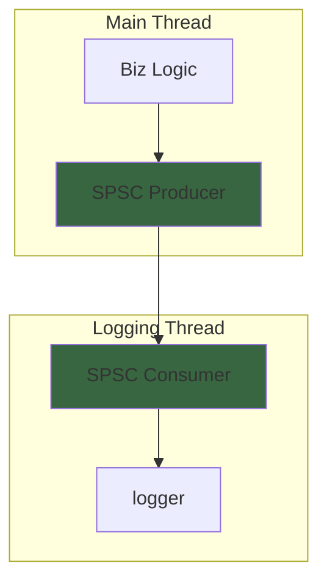

```js
import {FileAttachment} from "observablehq:stdlib";
import {GihubRepoLink} from "../../components/github.js";
const repos = FileAttachment("../../data/repos.json").json();
```

## What is HFT?

High-frequency trading (HFT) is a type of electronic trading that uses algorithms to transact a large number of orders at extremely high speeds. It is used by financial institutions, hedge funds, and proprietary trading firms to execute trades at microseconds level. HFT is a controversial practice that has been criticized for its potential to disrupt markets and create instability. However, it is also a highly profitable strategy that can generate significant returns for those who are able to execute it successfully.

## Why Rust for HFT?

<a href="https://www.rust-lang.org/" target="_blank" rel="noopener">

</a>
Rust is a systems programming language that is designed for performance, reliability, and safety. It is well-suited for use in HFT systems, where speed and performance are critical. Rust's memory safety guarantees and zero-cost abstractions make it an ideal choice for developing low-latency trading systems that can execute trades quickly and efficiently.

Having said that, C++ is by far the most popular language for HFT systems.
Most established trading houses have large, highly-tuned, money-generating codebases in C++ and it would be a huge and risky endeavour to port them over to Rust, especially when the performance implications are perhaps not well understood. It will take time and it might not happen.

However, Rust is gaining popularity in the financial industry due to its safety features and modern design. Rust is also easier to learn and use than C++, which can make it a more attractive option for developers who are new to HFT.

Both Rust and C/C++ don't have [garbage collectors](https://en.wikipedia.org/wiki/Garbage_collection_(computer_science)), which is a big advantage in HFT systems where latency is critical. The garbage collector can introduce unpredictable pauses in the execution of the program, which can lead to missed trades and lost profits.

## General Rules for HFT

When writing HFT systems, there are a few general rules that you should follow to ensure that your system is fast, reliable, and efficient.

* Memory operations tend to be quite expensive compared to arithmetic operations. Therefore, it is important to minimize the number of memory operations in your code. This can be achieved by using stack memory instead of heap memory, and by avoiding unnecessary allocations and deallocations. Think about [Copy](https://doc.rust-lang.org/std/marker/trait.Copy.html) vs [Clone](https://doc.rust-lang.org/std/clone/trait.Clone.html) traits in Rust.
* IO operations, such as writing or reading to disk or to a network socket, are also expensive. It is important to minimize the number of IO operations in the crytical path of your HFT code.

## Multi Threaded vs Single Threaded Process

One of the key design decisions when developing an HFT system is whether to use a multi-threaded or single-threaded architecture. Multi-threaded systems can take advantage of multiple cores and processors to execute trades more quickly, but they can also be more complex to develop and maintain. Single-threaded systems are simpler and easier to debug, but they may not be able to achieve the same level of performance as multi-threaded systems.

In addition, the cost of inter-thread communication (~100ns) is not negligible and can be a bottleneck in a multi-threaded system.

Multi-threaded system are the norm in HFT system, but one must be aware of the trade-offs and therefore carefully design the system with as few threads communicating as possible.

## SPSC Queues

Single-producer, single-consumer (SPSC) queues are a type of lock-free data structure that can be used to pass messages between two threads in a multi-threaded system. SPSC queues are designed to be fast and efficient, with low latency and high throughput.

Rusts has few libraries that implement SPSC queues


```tsx
display(<GihubRepoLink repo={repos["mgeier/rtrb"]} />);
```
```tsx
display(<GihubRepoLink repo={repos["agerasev/ringbuf"]} />);
```
```tsx
display(<GihubRepoLink repo={repos["erenon/cueue"]} />);
```

An example where SPSC queues are very useful is separation of logic. For example, one could use a separate thread to perform the application logging. In other words, you could have an HFT bot running the main business logic on one thread which write logs to SPSC queue (log producer). The logging threads consumes the logs from the queue consumer and writes them to disk (or wherever is desired).



Most SPSC queues are implemented using a FIFO [ring buffer](https://en.wikipedia.org/wiki/Circular_buffer), which is a circular buffer that can be used to store a **fixed number** of elements. Ring buffers are fast and efficient, with constant-time access to elements and no need for locks or other synchronization mechanisms.

## Processor Affinity

Another important consideration when developing an HFT system is processor affinity, aka CPU pinning.
Processor affinity is the ability to bind a thread to a specific CPU core or set of CPU cores. This can help to reduce the latency of the system by ensuring that the thread is always running on the same core, which can reduce the overhead of context switching and cache misses.

### Understanding the basics

* **OS Scheduler** - The operating system's scheduler is responsible for distributing threads and processes across the available [CPU](https://en.wikipedia.org/wiki/Central_processing_unit) cores.
* **CPU Cores** - Modern CPUs often have multiple cores, allowing them to execute multiple threads, across these cores, simultaneously.
* **Threas** - A thread is the smallest sequence of programmed instructions that can be managed independently by the a scheduler, which is typically a part of an operating system.  
* **Process** - A process is an instance of a computer program that is being executed. A process can contain one or more threads as we discussed above.

### Why CPU pinning?

Without pinning, the scheduler dynamically moves threads between cores to optimize overall system performance.
However, this can lead to increased latency and jitter in HFT systems, as the thread may be moved to a different core at any time, causing cache misses and other performance issues. By pinnning a thread to a specific core you get the following performance benefits:

* **Cache Affinity** - Data related to that thread remains in the same CPU's cache memory. This reduces the need to fetch data from slower main memory, significantly improving performance.
* **Reduced Context Switching** - Moving a thread between cores (context switching) is a relatively expensive operation. Pinning minimizes this overhead.

Rust provides this library

```tsx
display(<GihubRepoLink repo={repos["Elzair/core_affinity_rs"]} />);
```

```rust
extern crate core_affinity;

use std::thread;

// Retrieve the IDs of all cores on which the current
// thread is allowed to run.
// NOTE: If you want ALL the possible cores, you should
// use num_cpus.
let core_ids = core_affinity::get_core_ids().unwrap();

// Create a thread for each active CPU core.
let handles = core_ids.into_iter().map(|id| {
    thread::spawn(move || {
        // Pin this thread to a single CPU core.
        let res = core_affinity::set_for_current(id);
        if (res) {
          // Do more work after this.
        }
    })
}).collect::<Vec<_>>();

for handle in handles.into_iter() {
    handle.join().unwrap();
}
```

To check your CPU cores, you can use the following command in Linux:

```bash
lscpu
```

For example, the output of the command might look like this:

```bash
Architecture:             x86_64
  CPU op-mode(s):         32-bit, 64-bit
  Address sizes:          46 bits physical, 48 bits virtual
  Byte Order:             Little Endian
CPU(s):                   20
  On-line CPU(s) list:    0-19
Vendor ID:                GenuineIntel
  Model name:             13th Gen Intel(R) Core(TM) i7-1370P
    CPU family:           6
    Model:                186
    Thread(s) per core:   2
    Core(s) per socket:   10
    Socket(s):            1
    Stepping:             2
```

In this example, the CPU has 20 cores, with 2 threads per core.

## Additional Considerations

There are many other factors to consider when developing an HFT system, including network latency, market data feeds, order execution, and risk management. I won't go into details here, but it is important to carefully consider all of these factors when designing your system.

There are several specialized libraries that can help you with these and other tasks, this is a list of some of them:

```tsx
display(<GihubRepoLink repo={repos["Amanieu/parking_lot"]} />);
```

```tsx
display(<GihubRepoLink repo={repos["metrics-rs/quanta"]} />);
```

```tsx
display(<GihubRepoLink repo={repos["elast0ny/shared_memory"]} />);
```

```tsx
display(<GihubRepoLink repo={repos["SoftbearStudios/bitcode"]} />);
```

```tsx
display(<GihubRepoLink repo={repos["gyscos/zstd-rs"]} />);
```


## Some References

* [The coded message](https://www.thecodedmessage.com/)
* [Rust: A Better C++ Than C++](https://www.thecodedmessage.com/rust-c-book/)
* [Fast Logging for HFT In Rust](https://markrbest.github.io/fast-logging-in-rust/)
* [Louis Ponet blog](https://louisponet.github.io/blog/)
